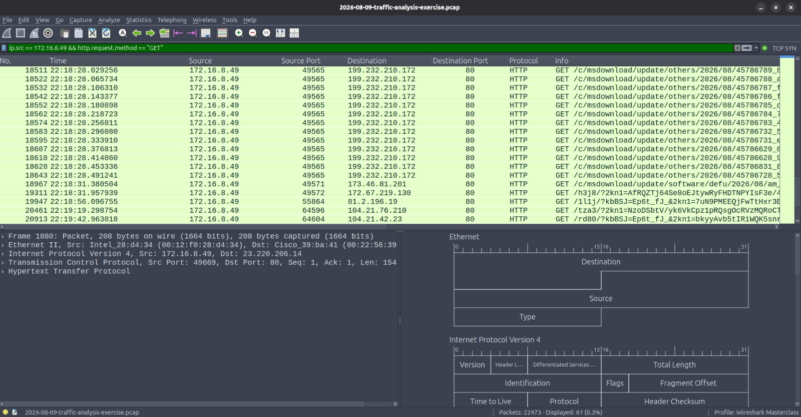
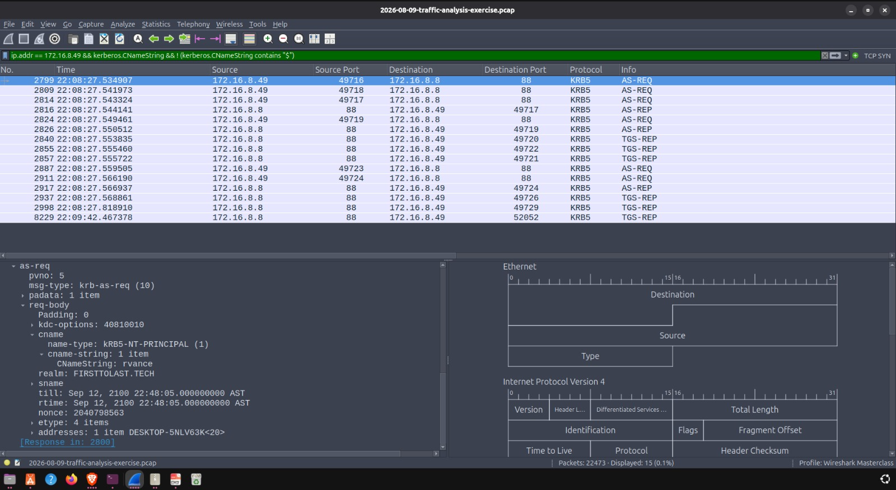

### Case Study 2: Network Traffic Analysis & Soc Triage

* **Analytical Objective:** Investigate a captured network packet payload following multiple SOC alerts for FormBook/XLoader command-and-control (C2) check-in traffic, in order to identify the infected host, trace the compromise, and attribute it to a specific user account.

* **Scenario:** While covering a SOC shift, six alerts fired within a three-minute window flagging outbound HTTP GET requests to known FormBook C2 infrastructure. A packet capture (pcap) covering the alert window was pulled for investigation to identify the infected host on the internal `172.16.8.0/24` network.

* **Evidence:**
  
  *Filtered view showing internal host `172.16.8.49` sending repeated HTTP GET check-ins to multiple external C2 IP addresses.*

  
  *Kerberos AS-REQ traffic showing the `cname-string: rvance` field, attributing the infection to a specific domain user account.*

* **Analysis:** Applied the Boolean display filter `ip.src == 172.16.8.49 && http.request.method == "GET"` to isolate repeated outbound GET check-ins from internal host `172.16.8.49` to six distinct external C2 addresses — confirming active beaconing consistent with the alerted FormBook/XLoader behavior. Pivoted to the host's MAC address (`00:12:f0:28:d4:34`) and hostname (`DESKTOP-5NLV63K`, via NetBIOS traffic) to fully identify the physical device. Attributed the infection to a specific user account by filtering Kerberos authentication traffic with `kerberos.CNameString`, excluding machine accounts (`$` suffix), and identifying the account `rvance`. LDAP directory traffic was found to be SASL/Kerberos-encrypted, preventing direct network-based recovery of the account's full display name; this was later confirmed as **Raymond Vance** via the exercise's incident documentation.

* **Indicators of Compromise (IOCs):**

| Type | Indicator | Notes |
|---|---|---|
| Malware Family | XLoader (alerted as FormBook) | Rebrand/successor of FormBook |
| Infected Host IP | 172.16.8.49 | Internal victim |
| Infected Host MAC | 00:12:f0:28:d4:34 | |
| Infected Hostname | DESKTOP-5NLV63K | |
| Compromised User | rvance (Raymond Vance) | |
| C2 IP | 172.64.155.76:80 | GET check-in |
| C2 IP | 146.59.71.167:80 | GET check-in |
| C2 IP | 38.182.168.246:80 | GET check-in |
| C2 IP | 45.130.41.161:80 | GET check-in |
| C2 IP | 172.67.162.153:80 | GET check-in |
| C2 IP | 121.54.163.148:80 | GET check-in |

* **Why It Matters:** This case demonstrates the core SOC Tier 1/2 workflow — moving from a raw automated alert to a fully attributed incident. Rather than stopping at "this IP triggered an alert," the investigation traces the compromise through host identification, network artifact correlation, and authentication traffic to answer the question a real incident report requires: *which device, and which person, needs to be contained.*
